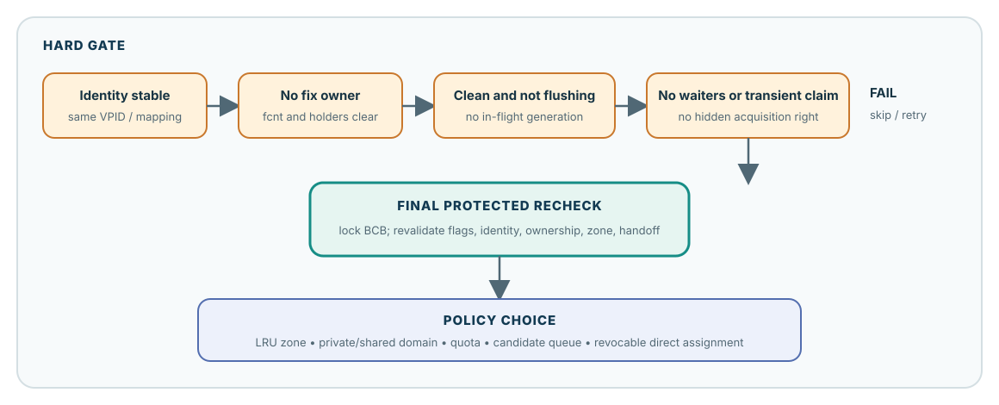
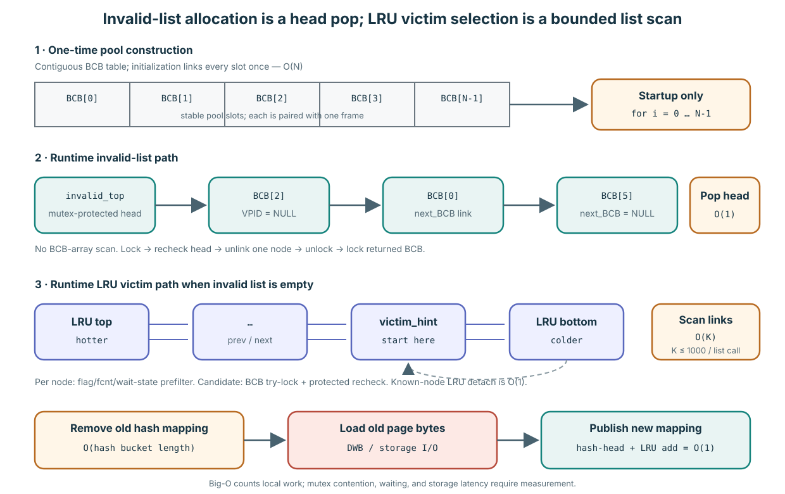
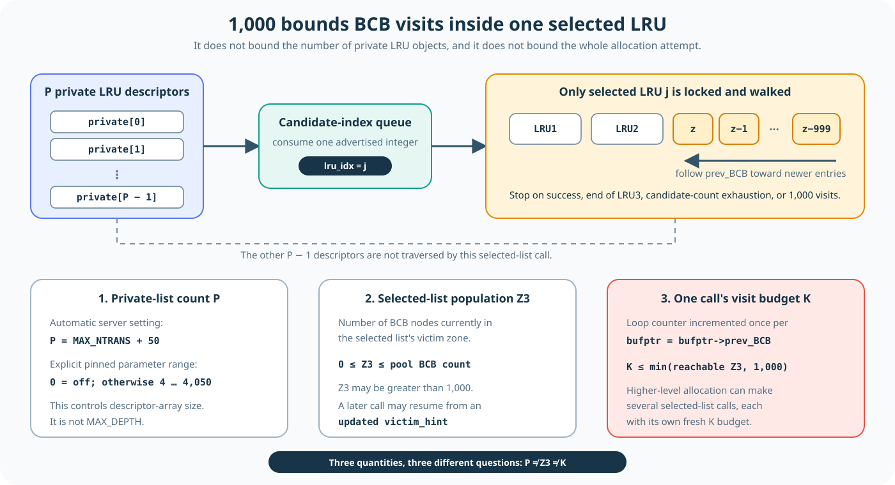
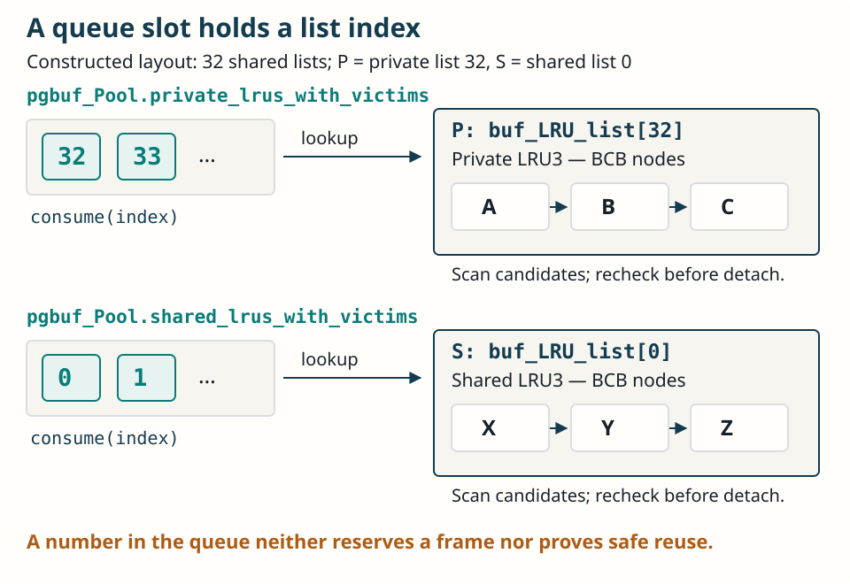
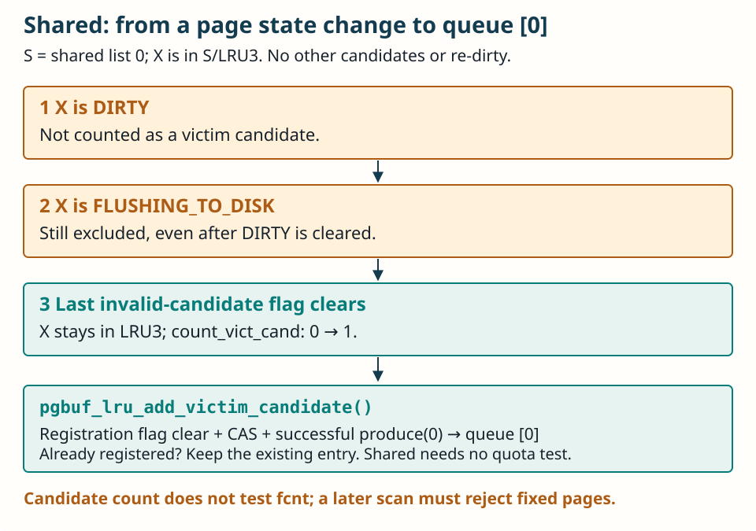
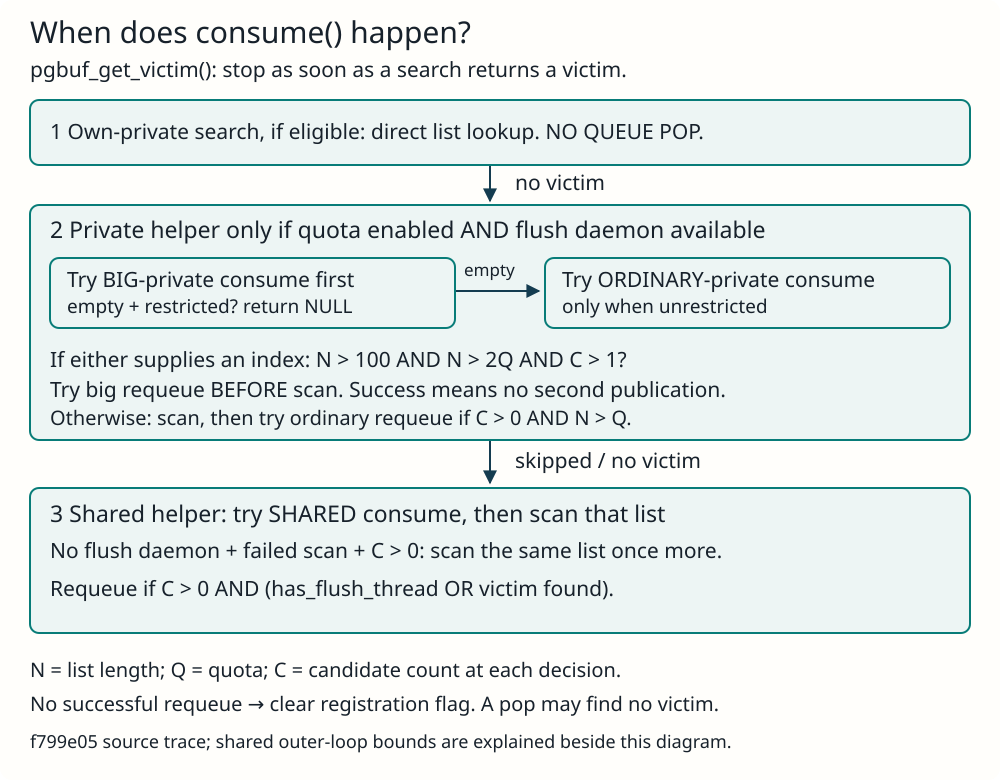
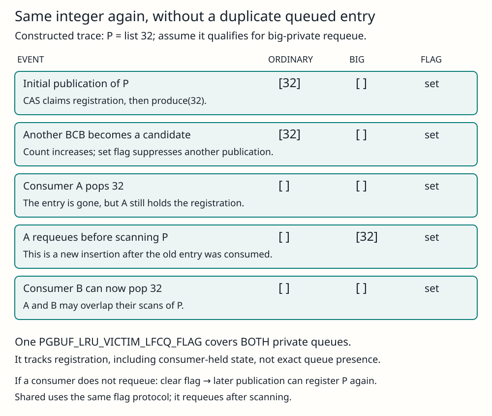
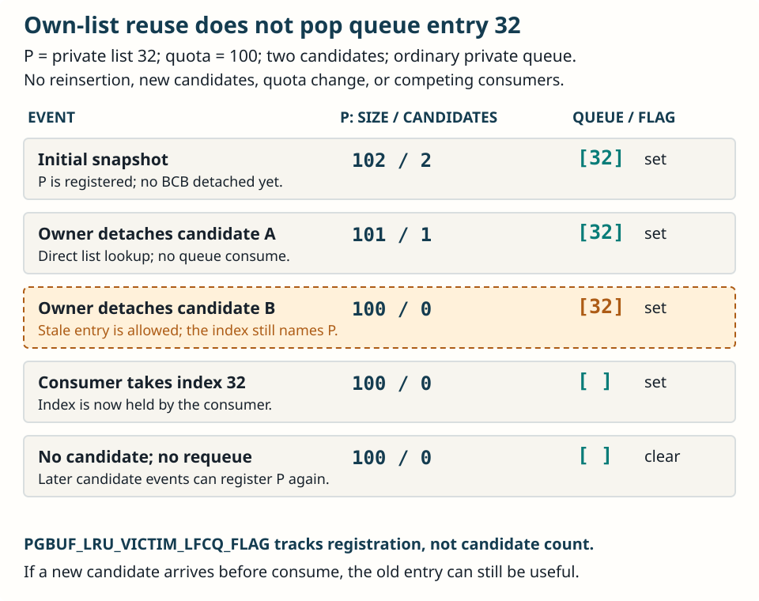

# Replace One Frame: Eligibility Before Policy

**Level:** Core
**Prerequisites:** [Fix, Hold, and Release](./02-fix-hold-release.md) and [Flush One Generation](./04-flush-one-generation.md)
**Capability gained:** Prove whether one resident frame is safe to reuse before evaluating replaceable selection and progress policy.
**Source baseline:** `f799e05d77d5300c6ea5753b4a6cc7caee6d8912`
**Evidence used:** Verified mechanism, Implementation policy, and Runtime observation from the [pinned-source inventory](../source-inventory.md) and exact source ranges cited below.

## The maintainer question

Replacement has two layers. **Eligibility** asks whether reuse is safe now. **Policy** asks which safe candidate should be chosen and how the system should make progress under pressure. An optimization may change policy; it must not weaken eligibility.

## Hard eligibility

A candidate must pass all of these conditions, then pass them again at the protected handoff:

| Predicate | Why reuse must stop when it fails |
|---|---|
| **Identity is stable** | The frame must still represent the VPID/list candidate that selection examined; rebinding stale identity would corrupt the page table. |
| **No ownership remains** | `fcnt` must be zero and no thread may still fix the frame. A waiter or granted/transient claim can make apparently idle state non-reusable. |
| **Generation is propagatable** | `DIRTY` means bytes still need propagation; `FLUSHING` means a copied generation has not completed. Direct-victim flags also exclude ordinary selection. |
| **No conflicting waiter/transient state** | Latch waiters and in-progress protocol states can carry rights not summarized by a casual counter read. |
| **Final protected revalidation succeeds** | Selection observations can go stale. Under BCB protection, recheck flags, ownership, identity/zone, and any handoff-specific conditions immediately before unlink/reuse. |

The pinned ordinary LRU path scans the victim zone, rejects avoid-victim flags and fixed frames, conditionally locks the BCB, calls `pgbuf_is_bcb_victimizable(..., true)`, and only then removes the frame from its LRU list. Source: `src/storage/page_buffer.c:9293-9538`.

### “Protected handoff” in concrete steps

**Handoff** is the ownership transition from “the LRU scan has nominated this pointer” to “the allocator exclusively owns a detached BCB, still locked, and may victimize/rebind it.” The scan result alone carries no such authority.

Suppose the reusable slot at address `BCB[42]` represents VPID A:

1. Under the LRU mutex, the scan reads cheap prefilters: LRU3 membership, avoid-victim flags, `fcnt`, latch mode, and waiter state. It remembers the pointer to `BCB[42]`.
2. Those facts are not all protected by the LRU mutex. A fixer/unfixer or flush/direct-victim protocol can change BCB ownership and flags; another path can own the BCB mutex. “All clear before lock” means only that the prefilter samples passed at this instant.
3. The scan uses `PGBUF_BCB_TRYLOCK()` rather than waiting while it holds the LRU mutex. Failure means another BCB transition is in progress, so the scan skips the candidate.
4. With both the list membership protected by the LRU mutex and the BCB state protected by the BCB mutex, `pgbuf_is_bcb_victimizable(..., true)` reads the current state again. Only an all-clear result permits `pgbuf_remove_from_lru_list()` to unlink it and change its encoded zone to `PGBUF_VOID_ZONE`.
5. The function releases the LRU mutex but returns the BCB still locked. The allocator can now complete `pgbuf_victimize_bcb()` without another thread treating the detached slot as the old ordinary resident candidate.

Without steps 3–5, an A-based decision could be applied after ownership, flags, or list position changed—or, in a broader reuse race, after the stable address had been detached and rebound to VPID B. “Stale” means the read was once true but no longer describes the state on which the destructive action will operate. Protection does not make the earlier read eternal; it establishes a current all-clear state and prevents conflicting transitions through the detach boundary.

Source: unprotected prefilters, try-lock, protected recheck, unlink, and locked return at `src/storage/page_buffer.c:9399-9478`; zone/index mutation at `src/storage/page_buffer.c:15900-16030`.

### What “no waiters or transient claim” means

These are guide terms for several concrete source states, not one field named `transient_claim`:

| Source-visible state | Why it blocks ordinary reuse |
|---|---|
| `atomic_latch.fcnt > 0` | One or more granted fixes still own the frame. |
| `next_wait_thrd != NULL` | A latch/flush waiter remains enrolled in the BCB protocol. Even before a new fix is granted, detaching the BCB would strand or misdirect its wake/grant transition. |
| Latch mode is not `PGBUF_NO_LATCH` when the BCB mutex is not owned by the checker | The sampled zero count may be inside a transition. With the BCB mutex owned, the source recognizes the narrow unfix case in which latch mode is temporary and will be cleared before unlock. |
| BCB try-lock fails | Another thread currently owns the BCB transition guard. The scanner does not wait while holding the LRU mutex; it skips this candidate. |
| `PGBUF_BCB_VICTIM_DIRECT_FLAG` or `PGBUF_BCB_INVALIDATE_DIRECT_VICTIM_FLAG` | A direct-victim producer/consumer handoff already owns or has invalidated the candidate; ordinary LRU selection must not claim it again. |

`pgbuf_is_bcb_fixed_by_any()` implements the first three checks, with different latch-mode treatment depending on whether the caller owns the BCB mutex. The invalid-victim flag mask adds DIRTY, FLUSHING, and the two direct-victim flags. Source: `src/storage/page_buffer.c:225-263,9265-9325,16217-16231`.

### Clean state and completed I/O are separate requirements

A DIRTY BCB contains a resident generation whose bytes have not completed the configured page-image propagation boundary. Detaching and overwriting that frame would lose those bytes.

A FLUSHING BCB may no longer be DIRTY for the copied generation, but completion still refers to the old BCB identity and snapshot: WAL forcing, DWB/direct submission, flag clearing, waiter wakeup, and possibly post-flush victim handoff have not all completed. Rebinding the BCB during that interval could let old-generation completion mutate or wake state now associated with another resident identity. Concurrent re-dirty makes the distinction sharper: generation G can be FLUSHING while the current resident generation G+1 is DIRTY. Both predicates must therefore be false before ordinary reuse.

The source enforces this with `PGBUF_BCB_INVALID_VICTIM_CANDIDATE_MASK`; `pgbuf_bcb_avoid_victim()` rejects DIRTY, FLUSHING, direct-victim-assigned, and direct-victim-invalidated flags. Source: `src/storage/page_buffer.c:221-263,9293-9311,16217-16231`; generation completion at `src/storage/page_buffer.c:10723-10962`.

### Counterexample: `fcnt == 0` is insufficient

Imagine a scanner observes `fcnt == 0`, but the frame is `DIRTY`; reuse would discard unpropagated bytes. Or it observes zero before a waiter/fixer commits ownership, then acts after the state changes. Or the frame is `FLUSHING`, so the copied image still refers to its identity. The number zero is one predicate sampled at one time—not a reuse proof.

**Interface contract:** no caller may retain a successful fix when a frame is rebound. **Implementation policy:** the protected final check is the seam that turns fallible candidate observations into a safe reuse decision.

## When victim selection is actually attempted

Victim selection is demand-driven by a miss that must materialize a page. `pgbuf_allocate_bcb()` first tries the invalid/free list. Only when that list returns no BCB does it call `pgbuf_get_victim()` and search the LRUs. “The pool is full” is a reasonable shorthand for “no identity-free pool slot is immediately available,” but it does not mean every slot is an ordinary LRU member: slots can be fixed, provisional, flushing, directly assigned, or in another transient state.

### From a queued index to a victim hint and a protected victim

**Verified mechanism at f799e05:** after `consume(lru_idx)`, the private/shared queue helper calls `pgbuf_get_victim_from_lru_list(thread_p, lru_idx)`. This selects `pgbuf_Pool.buf_LRU_list[lru_idx]`. An empty candidate count returns immediately; otherwise the helper locks the LRU, checks for LRU3, optionally adjusts private zones, and checks the count again. It starts at `victim_hint`, or `bottom` if the hint is null, and follows `prev_BCB` toward newer BCBs within LRU3. Before choosing that start, a clean bottom can reset the hint to bottom.

`victim_hint` is a BCB pointer stored in each `PGBUF_LRU_LIST`, initially null. It remembers a useful search start to avoid repeatedly inspecting an unproductive older prefix. It neither reserves the BCB nor certifies that it can be reused. In particular, a hint can point to a fixed page. A newly counted candidate need not be a newly inserted page: clearing the last exclusion flag on a page already in LRU3 can make it a candidate without moving it.

| Event | Position and hint update |
|---|---|
| Ordinary demotion into LRU3 | The LRU2 boundary BCB (or LRU1 boundary when LRU2 is empty) stays in place while the zone boundary changes. Unless directly assigned instead, it becomes the newest LRU3 entry with the current list tick. An existing older hint can remain. |
| Insertion at LRU3 bottom | `pgbuf_lru_add_bcb_to_bottom()` connects directly after the saved bottom pointer and assigns a tick one step older than the old LRU3 bottom, with wrap handling. A flag-eligible new tail can replace the hint. There is no sorted-position search. |
| An existing LRU3 page becomes eligible after flush | Its links and age stay unchanged. If older than the current hint, it can become the new hint in place. |
| Any candidate addition | `pgbuf_lru_add_victim_candidate()` first compares wrap-aware ages: retain a current LRU3 hint if strictly older; otherwise attempt CAS to the added BCB, retrying on interference. Then increment the candidate count and attempt queue registration where policy permits. |
| Scan or removal | A scan can remember the first fixed or try-lock-blocked candidate for a later attempt. Removing the hinted BCB advances the hint toward `prev_BCB`, or conditionally falls back to bottom/null. A failed scan with no remembered candidate can also reset it to bottom/null. |

For example, read `A — H — X` from newer to older within LRU3. If H is the hint and dirty X becomes eligible after flush, only the hint changes to X. Conversely, demoting N gives `N — A — H — X`; N is newer, so an older H can remain the hint. These are constructed source-derived examples, not runtime observations. Linking one tail and comparing two ages require constant structural work; CAS retries and lock waits affect elapsed time. Demoting D boundary nodes costs O(D), and actual victim search remains a separate bounded walk.

Candidate eligibility requires all four bits in `PGBUF_BCB_INVALID_VICTIM_CANDIDATE_MASK` to be clear:

| Flag | Why ordinary candidate selection excludes it |
|---|---|
| `PGBUF_BCB_DIRTY_FLAG` | Modified bytes still require preservation. |
| `PGBUF_BCB_FLUSHING_TO_DISK_FLAG` | A flush is still in progress. Clearing DIRTY alone does not finish it. |
| `PGBUF_BCB_VICTIM_DIRECT_FLAG` | This BCB has been directly assigned to a waiting allocator; ordinary selection must not take the same assignment. |
| `PGBUF_BCB_INVALIDATE_DIRECT_VICTIM_FLAG` | That assignment was invalidated, for example by fixing the page again. The direct consumer detects it, clears the invalidation flag, and rejects the assignment. |

Thus a clean, non-flushing tail is not automatically the victim. Candidate counting does not require `fcnt == 0`. The scan rejects avoid-victim/fixed states, attempts `PGBUF_BCB_TRYLOCK`, and calls `pgbuf_is_bcb_victimizable(..., true)` to recheck current state, including waiters. On success it detaches the BCB, releases the LRU mutex, and returns with the BCB lock held. Without intervening changes, an eligible tail that passes every check and the try-lock is the first successful victim of that selected-list scan. Otherwise the scan continues or exits early; it stops at the LRU3 boundary, null, or 1,000 visits and returns null if unsuccessful. This does not promise that the allocator will select this LRU next.

Source: [queue consumers](https://github.com/CUBRID/CUBRID/blob/f799e05d77d5300c6ea5753b4a6cc7caee6d8912/src/storage/page_buffer.c#L16424-L16559), [scan and hint repair](https://github.com/CUBRID/CUBRID/blob/f799e05d77d5300c6ea5753b4a6cc7caee6d8912/src/storage/page_buffer.c#L9324-L9538), [tail insertion](https://github.com/CUBRID/CUBRID/blob/f799e05d77d5300c6ea5753b4a6cc7caee6d8912/src/storage/page_buffer.c#L9841-L9880), [demotion](https://github.com/CUBRID/CUBRID/blob/f799e05d77d5300c6ea5753b4a6cc7caee6d8912/src/storage/page_buffer.c#L10059-L10121), [candidate and hint updates](https://github.com/CUBRID/CUBRID/blob/f799e05d77d5300c6ea5753b4a6cc7caee6d8912/src/storage/page_buffer.c#L15674-L15776), [candidate mask](https://github.com/CUBRID/CUBRID/blob/f799e05d77d5300c6ea5753b4a6cc7caee6d8912/src/storage/page_buffer.c#L253-L263), [direct consumer](https://github.com/CUBRID/CUBRID/blob/f799e05d77d5300c6ea5753b4a6cc7caee6d8912/src/storage/page_buffer.c#L15597-L15627).

#### Direct-victim producers and the flush-completion exception

In server mode, the common setter is `pgbuf_assign_direct_victim()`. Its caller holds the BCB mutex and establishes reusability: no dirty data, no fix ownership, and neither direct-assignment flag. It consumes a waiting-thread entry, locks it, and verifies `THREAD_ALLOC_BCB_SUSPENDED`. Under that thread-entry lock it marks the allocator resumed, sets `PGBUF_BCB_VICTIM_DIRECT_FLAG`, and publishes the BCB in `direct_victims.bcb_victims[waiter_thread->index]`. No actual waiter means no assignment; outside server mode the helper returns false.

| Producer path | Opportunity to hand off a BCB |
|---|---|
| `pgbuf_assign_flushed_pages()` | Post-flush processing locks and rechecks a flushed BCB, including LRU3 membership and over-quota policy for private lists. |
| Flush-candidate search | Can encounter a clean BCB and try direct assignment under a BCB try-lock and protected recheck. |
| `pgbuf_lru_fall_bcb_to_zone_3()` | Can directly assign and detach before ordinary demotion, subject to the to-vacuum exception and protected eligibility. |
| Vacuum unfix branches | Eligible LRU3 or VOID BCBs can feed waiting allocators instead of ordinary placement/promotion. |
| `pgbuf_lru_add_new_bcb_to_bottom()` | Tries assignment before tail insertion and returns without insertion on success. |
| `pgbuf_panic_assign_direct_victims_from_lru()` | Scans under pressure, try-locking and rechecking candidates. The separate maintenance backup retains the [VS-20 limitation](../unresolved-or-version-sensitive-findings.md). |

These are verified source call paths, not runtime coverage claims. The flush-completion caller may still have `PGBUF_BCB_FLUSHING_TO_DISK_FLAG` set; the common setter clears it while setting the direct flag. This special completion transition does not authorize assignment during unfinished I/O. The consumer later rejects an invalidated assignment or clears the direct flag and rechecks victimizability before using it.

Source: [setter and post-flush producer](https://github.com/CUBRID/CUBRID/blob/f799e05d77d5300c6ea5753b4a6cc7caee6d8912/src/storage/page_buffer.c#L15421-L15567), [flush search](https://github.com/CUBRID/CUBRID/blob/f799e05d77d5300c6ea5753b4a6cc7caee6d8912/src/storage/page_buffer.c#L3829-L3844), [vacuum unfix](https://github.com/CUBRID/CUBRID/blob/f799e05d77d5300c6ea5753b4a6cc7caee6d8912/src/storage/page_buffer.c#L6817-L6937), [new bottom](https://github.com/CUBRID/CUBRID/blob/f799e05d77d5300c6ea5753b4a6cc7caee6d8912/src/storage/page_buffer.c#L10276-L10302), [panic producer](https://github.com/CUBRID/CUBRID/blob/f799e05d77d5300c6ea5753b4a6cc7caee6d8912/src/storage/page_buffer.c#L9549-L9598).

### Concrete structures and operation costs

The BCB pool storage and the runtime lists are different layers. `BCB_table` is one contiguous array allocated at page-buffer initialization. The initialization loop pairs every BCB with one frame and sets each BCB's `next_BCB` to the next array entry. `pgbuf_initialize_invalid_list()` then points `invalid_top` at `BCB[0]`. Building this initial chain is O(`N`) once for `N` buffers.

At runtime, “try the invalid list” does **not** mean scan the BCB array. `PGBUF_INVALID_LIST` is a mutex, `invalid_top`, and `invalid_cnt`; its BCB nodes form a singly linked list through `next_BCB`. `pgbuf_get_bcb_from_invalid_list()` first reads an unlocked empty hint, then locks and rechecks. On success it advances `invalid_top` by one link, decrements the count, unlocks the list, locks the returned BCB, clears its list link, and moves it to the void zone. The list manipulation is O(1), although mutex scheduling can make wall-clock time variable. Returning a BCB to the invalid list is likewise a head push.

The LRU path is different. Each LRU is doubly linked. `pgbuf_get_victim_from_lru_list(thread_p, lru_idx)` receives the index of **one list that has already been selected**. It starts from that list's `victim_hint`, or its bottom when no hint exists, and follows `bufptr->prev_BCB` through LRU3 toward newer nodes. Entering the loop body once is one BCB-node visit: inspect its flags and ownership, perhaps try-lock it, then either return it or advance one link. The body can run at most `MAX_DEPTH == 1000` times in that invocation. “1,000 links” therefore does not mean an array of 1,000 lists and does not mean that 1,000 victims are found. It means at most 1,000 candidate-position visits inside one selected LRU3.

Keep three quantities separate. `P` is the number of private LRU descriptors. `Z3` is the number of BCBs in the selected list's LRU3. `K` is how many of those nodes this call visits, with `K ≤ min(Z3 reachable from the start, 1000)`. The selected list can contain more than 1,000 nodes; this call stops before node 1,001 and a later attempt may start from an updated hint. Conversely, it can return after one visit if the first BCB passes the protected check.

The private-list count is not capped at 1,000. In pinned server mode, `num_private_chains = -1` expands to `MAX_NTRANS + VACUUM_MAX_WORKER_COUNT`, and the latter constant is 50. An explicit positive setting is floored to four and its parameter-table maximum is 4,050; automatic `MAX_NTRANS` also includes admin/HA-reserved connections and is not clamped to 1,000 by the initializer. The two other source uses of 1,000 are unrelated: the explicit **shared** `num_LRU_chains` maximum and the automatic target of roughly 1,000 buffers per shared list.

The higher-level `pgbuf_get_victim()` may make several selected-list calls: caller's private list, an advertised other-private index, an advertised shared index, and a final own-list fallback. Therefore 1,000 is not a whole-allocation bound. Moreover, when a selected private list is over quota, the helper may first demote `M` boundary BCBs into LRU3; that adjustment is outside `MAX_DEPTH`. The precise helper cost is O(`M + K`) with `K ≤ 1000`, while the scan itself is a bounded O(`K`) linked-list walk. Each cheap reject is constant-field work, a plausible candidate receives a non-waiting BCB try-lock and protected recheck, and known-node removal is O(1).

After LRU detach, `pgbuf_victimize_bcb()` removes the old VPID mapping from its hash bucket. That bucket is a singly linked chain, so removal is O(`B`) for bucket length `B`, plus possible hash-mutex wait. Loading a requested old page then uses DWB or data-volume I/O (and possibly decryption); storage latency is not meaningfully captured by calling the CPU step O(1). Publishing the new mapping at the hash head and adding the BCB to one LRU are constant-link insertions, again with possible mutex contention.

| Stage | Structural CPU work | Latency qualification |
|---|---|---|
| Initial BCB/invalid chain | O(`N`) once | Startup only. |
| Invalid-list pop or push | O(1) | No array scan; shared invalid-list mutex may wait. |
| One selected-LRU helper | O(`M + K`), `K ≤ 1000` | `M` is optional pre-scan zone demotion; the bounded LRU3 walk holds one LRU mutex, and cache behavior, failed try-locks, and candidate distribution matter. |
| Protected candidate recheck | O(1) | Try-lock skips rather than waiting, but repeated skips extend the scan. |
| Known-node LRU detach | O(1) | Performed under the LRU mutex. |
| Old hash mapping removal | O(`B`) | `B` is bucket-chain length; hash mutex may wait. |
| Old-page materialization | Storage operation | DWB/file read and optional decryption can dominate. |
| Hash-head/LRU publication | O(1) link work | Hash/LRU mutex wait remains workload-dependent. |

The pinned source does not provide a universal nanosecond duration. It instruments allocation, victim-search subphases, and condition waits through `PSTAT_PB_ALLOC_BCB`, `PSTAT_PB_ALLOC_BCB_SEARCH_VICTIM`, list-search timers, and condition-wait timers. Use those observations or a focused benchmark for the target build and workload; Big-O alone is not a latency measurement.

Source: invalid-list structure at `src/storage/page_buffer.c:626-634`; BCB array/link initialization at `5559-5660`; invalid head initialization and pop/push at `5907-5919,8905-8983`; per-list bound and scan at `9327-9537`; zone adjustment at `9984-10048`; high-level list selection at `9067-9263`; private-list count at `13941-13985` and `src/base/system_parameter.c:4171-4182`; hash deletion at `7883-7957`; BCB allocation timing at `8181-8403`. Full derivation: [Victim scan cap and AOUT status](../reference/victim-scan-cap-and-aout-evidence.md).

If every BCB is fixed, the invalid list is empty and every LRU candidate fails ownership eligibility. The page buffer never steals one. With the page-flush daemon available, the requesting server thread enters the direct-victim wait protocol; an unfix can eventually make a clean BCB eligible and feed it. If ownership never ends, the request can leave only through timeout, interrupt, or shutdown. Without the daemon, the code flushes/searches synchronously and expects a victim; if none is produced, the allocation ultimately fails (the fallback error name is `ER_PB_ALL_BUFFERS_DIRTY`, even though “all fixed” is the actual reason in this scenario). This outcome exposes leaked or excessive ownership rather than weakening safety.

Source: demand and invalid-list-first rule at `src/storage/page_buffer.c:8181-8235`; wait/retry/bounded exits at `src/storage/page_buffer.c:8236-8403`; fixed/waiter rejection at `src/storage/page_buffer.c:9265-9325`.

## Selection and progress are policy

Once hard gates pass, the analyzed revision uses policy machinery: LRU placement and zones, private LRU and shared LRU domains, quota decisions, candidate queue/hint state, and direct assignment to threads waiting for a frame. These mechanisms affect fairness, locality, CPU cost, and progress; they do not redefine what “safe to reuse” means.

Keep formulas and daemon coordination in [Replacement Policy and Background Progress](../advanced/replacement-progress.md). In core review, ask: “Could this policy choice change while every hard predicate and final recheck remains intact?”

### List-index queues: publication, consumption, and stale entries

**Verified mechanism / Implementation policy at f799e05.** These queues route an allocator to a list to search. Their elements are integer full LRU indices; they neither hold BCB pointers nor reserve frames for the consumer. They are separate from the direct-victim assignment machinery. In the following constructed layout, there are 32 shared lists: P names private `buf_LRU_list[32]`, while S names shared `buf_LRU_list[0]`. P's queued number is the integer 32. Private-domain index 0 maps to full LRU index 32 in this layout.

The exact fields are `pgbuf_Pool.private_lrus_with_victims`, `pgbuf_Pool.big_private_lrus_with_victims`, and `pgbuf_Pool.shared_lrus_with_victims`, all `lockfree::circular_queue<int>` pointers. `pgbuf_lfcq_add_lru_with_victims()` uses CAS to set the list's `PGBUF_LRU_VICTIM_LFCQ_FLAG`, then calls `produce(lru_list->index)` on the ordinary private or shared queue. An already-set flag suppresses duplicate registration; a failed publication clears it. `pgbuf_lru_add_victim_candidate()` increments the candidate count and attempts registration for any shared list, or for a private list whose total size is strictly greater than quota. Every addition attempts registration, not only a zero-to-one count transition. `pgbuf_adjust_quotas()` also attempts registration for private lists with candidates above quota and for shared lists with candidates.

Source: [queue fields](https://github.com/CUBRID/CUBRID/blob/f799e05d77d5300c6ea5753b4a6cc7caee6d8912/src/storage/page_buffer.c#L819-L823), [publication](https://github.com/CUBRID/CUBRID/blob/f799e05d77d5300c6ea5753b4a6cc7caee6d8912/src/storage/page_buffer.c#L16370-L16414), [candidate addition](https://github.com/CUBRID/CUBRID/blob/f799e05d77d5300c6ea5753b4a6cc7caee6d8912/src/storage/page_buffer.c#L15674-L15720), [quota adjustment](https://github.com/CUBRID/CUBRID/blob/f799e05d77d5300c6ea5753b4a6cc7caee6d8912/src/storage/page_buffer.c#L14400-L14501).

#### When a shared list becomes discoverable

Candidate accounting requires LRU3 membership and no flag in `PGBUF_BCB_INVALID_VICTIM_CANDIDATE_MASK`: `PGBUF_BCB_DIRTY_FLAG`, `PGBUF_BCB_FLUSHING_TO_DISK_FLAG`, `PGBUF_BCB_VICTIM_DIRECT_FLAG`, and `PGBUF_BCB_INVALIDATE_DIRECT_VICTIM_FLAG`. It does **not** check fix count. The selected-list scan must still reject fixed pages and waiters and pass the protected eligibility check described above.

Two transitions reach candidate addition: `pgbuf_bcb_change_zone()` moves a flag-eligible BCB into LRU3, or `pgbuf_bcb_update_flags()` clears the last invalid-candidate flag while the BCB remains in LRU3. An ordinary admission or private-to-shared migration into shared LRU2 does not itself add a candidate; subsequent zone adjustment may move it into LRU3.

In this constructed flush trace, page X stays in shared S/LRU3, no other candidate exists, no re-dirty occurs, and no direct victim is assigned. DIRTY excludes X; FLUSHING continues to exclude it even after DIRTY clears. When the last exclusion flag clears, the count becomes one and S's index 0 is offered to the queue. A re-dirty or direct-victim flag prevents that transition. Conversely, a clean, flag-eligible BCB demoted from LRU2 to LRU3 can trigger registration without a flush.

Source: [candidate mask](https://github.com/CUBRID/CUBRID/blob/f799e05d77d5300c6ea5753b4a6cc7caee6d8912/src/storage/page_buffer.c#L253-L263), [flag transition](https://github.com/CUBRID/CUBRID/blob/f799e05d77d5300c6ea5753b4a6cc7caee6d8912/src/storage/page_buffer.c#L15817-L15838), [zone transition](https://github.com/CUBRID/CUBRID/blob/f799e05d77d5300c6ea5753b4a6cc7caee6d8912/src/storage/page_buffer.c#L15914-L15980), [flush completion](https://github.com/CUBRID/CUBRID/blob/f799e05d77d5300c6ea5753b4a6cc7caee6d8912/src/storage/page_buffer.c#L16108-L16112).

#### Concrete callers that add private or shared candidates

The two direct callers of `pgbuf_lru_add_victim_candidate()` are shared by private and shared lists:

| Event | Path through the direct caller | Condition for addition |
|---|---|---|
| Zone aging | `pgbuf_lru_adjust_zone2()` or `pgbuf_lru_adjust_zones()` → `pgbuf_lru_fall_bcb_to_zone_3()` → `pgbuf_bcb_change_zone()` | Enters LRU3 without blocking flags; successful direct assignment exits before this transition. |
| Bottom insertion/repositioning | `pgbuf_move_bcb_to_bottom_lru()` → `pgbuf_lru_add_bcb_to_bottom()` → `pgbuf_bcb_change_zone()`; VOID insertion also uses `pgbuf_lru_add_new_bcb_to_bottom()` | Destination LRU3, no blocking flags. Dirty bottom entries do not qualify. |
| Flush completion | `pgbuf_bcb_mark_was_flushed()` → `pgbuf_bcb_update_flags()` | Already LRU3; clearing FLUSHING removes the last blocker. Re-dirty prevents addition. |
| Explicit dirty clearing | `pgbuf_dealloc_temp_page()` or `pgbuf_invalidate_bcb()` → `pgbuf_bcb_clear_dirty()` → `pgbuf_bcb_update_flags()` | Already LRU3; DIRTY was the last blocker. Invalidation can remove the BCB afterward. |
| Direct-victim cleanup | `pgbuf_get_direct_victim()` or `pgbuf_allocate_bcb()` → `pgbuf_bcb_update_flags()` | Already LRU3; removing the direct-victim or invalidated-direct-victim flag clears the last blocker. |

The flag rule also applies to `pgbuf_bcb_mark_was_not_flushed(..., false)`: clearing the last blocker can add a candidate even on a failed-flush path; restoring DIRTY prevents it. A change in `fcnt` alone does not call candidate addition. Addition updates the hint and count before attempting publication; quota adjustment can publish existing candidates without a candidate-add call.

Source: pinned `page_buffer.c:9833–9880, 9943–10120, 10426–10462` (zone paths), `2828, 8714, 8336, 15611–15619` (cleanup), `15674–15720, 15817–15838, 15972–15980` (direct callers), `16064–16125` (flush flags).

#### Pop, requeue, and the big-private first-entry path

| Queue | Exact pop gate |
|---|---|
| `big_private_lrus_with_victims` | First consume attempt inside the private helper; the caller enters only when quota is enabled and a flush daemon is available. |
| `private_lrus_with_victims` | Big-private consume failed and `restricted == false`. |
| `shared_lrus_with_victims` | Shared stage reached without an earlier victim; private restriction does not skip this stage. |

The initial own-private search does not consume a queue. After that search is attempted and fails, a thread not exempt through `PGBUF_VACUUM_SHOULD_IGNORE_UNFIX()` sets `restrict_other` from `length > quota + MAX(10, (int)(quota * 0.01f))`. Otherwise the restriction remains false.

Without the flush daemon, after a failed shared helper call the caller can consume another index while the shared queue is nonempty, the consumer-cursor delta is at most `num_LRU_list`, and the incremented loop counter is at most `num_LRU_list`. With the daemon, this stage makes one helper call.

#### Repeated insertion versus duplicate registration

The same integer can be inserted repeatedly over time. The per-list flag/CAS protocol prevents multiple outstanding queue entries; the circular queue does not deduplicate integer values. One flag covers both private queues and remains set while a consumer holds the index. Consumers requeue directly with `produce()`. Early big-private publication permits overlapping scans of the same list without duplicate queued entries. Shared lists use the same registration protocol. If no requeue succeeds, clearing the flag allows a later candidate addition or quota adjustment to register that integer again.

#### Private and shared consumer decisions

The source calls a pop `consume(lru_idx)`. `pgbuf_get_victim()` reaches other-private queue discovery when quota is enabled and the flush daemon is available. `pgbuf_lfcq_get_victim_from_private_lru()` first tries the big-private queue; if empty, it falls back to the ordinary private queue only when `restricted` is false. It then tests the consumed list's size and candidate count. If size is greater than 100, greater than twice quota, and `count_vict_cand > 1`, it attempts to publish the index to the big-private queue **before** scanning. This can seed the big queue from an ordinary-queue entry, and makes the list discoverable by another consumer while the current consumer searches. The earlier contrary claim is corrected in [VS-19](../unresolved-or-version-sensitive-findings.md#b-current-pinned-revision-cleanup-and-proof-obligations).

After the selected-list scan, successful early big publication suppresses any second publication. Otherwise, the index is offered back to the ordinary queue only when candidates remain and the list is still above quota. If neither publication succeeds, the registration flag is cleared. A stale under-quota index with remaining candidates can therefore still receive one scan before being dropped; the consumer does not impose a fresh over-quota precondition before every selected-list call.

`pgbuf_lfcq_get_victim_from_shared_lru()` consumes a shared index and scans its list. Requeue requires candidates remaining and `(multi_threaded || victim != NULL)`; the call site passes `has_flush_thread` as `multi_threaded`. When false, an unsuccessful first scan with remaining candidates gets a second selected-list attempt. Without successful requeue, the consumer clears the registration flag.

Source: [selection order and call-site conditions](https://github.com/CUBRID/CUBRID/blob/f799e05d77d5300c6ea5753b4a6cc7caee6d8912/src/storage/page_buffer.c#L9115-L9216), [private consumer](https://github.com/CUBRID/CUBRID/blob/f799e05d77d5300c6ea5753b4a6cc7caee6d8912/src/storage/page_buffer.c#L16424-L16505), [shared consumer](https://github.com/CUBRID/CUBRID/blob/f799e05d77d5300c6ea5753b4a6cc7caee6d8912/src/storage/page_buffer.c#L16516-L16578).

#### Why two private queues, and what changes if the big queue is removed?

**Verified mechanism / Implementation policy.** The ordinary `private_lrus_with_victims` queue advertises over-quota private lists with candidates. `big_private_lrus_with_victims` gives priority to substantially over-quota lists. “Big” describes the list's total page count relative to quota, not the size of a page. Both queues contain integer list indices, not pages or reserved victims.

In a constructed example with quota 100, a list of 120 pages with candidates can be registered in the ordinary queue. A list of 300 pages with at least two candidates can be promoted to the big queue when a consumer encounters it. Promotion requires all three strict conditions: size > 100, size > 2 × quota, and candidate count > 1. Initial publication still goes through the ordinary queue; becoming large does not by itself insert an index directly into the big queue. Queue entries can become stale, so these registration conditions are not a guarantee about the list's state when later consumed.

The separate queue supports three behaviors:

| Behavior | Why the distinction matters |
|---|---|
| Search big donors first | The helper tries the big queue before the ordinary queue, favoring substantially over-quota lists as reclamation sources. |
| Keep a donor route for restricted callers | After a failed own-list search, a sufficiently over-quota, non-exempt requester can be restricted from consuming the ordinary queue. It may still consume the big queue. Shared search remains available afterward. |
| Publish a large donor before scanning it | Another consumer can discover the same list while the first searches. Ordinary requeue happens after scanning. Overlapping discovery does not reserve frames or bypass protected victim checks. |

**Inference.** This policy favors reclaiming excess holdings while limiting an already over-quota requester's access to ordinary private donors. It does not establish workload fairness or a measured performance benefit.

Suppose a coherent implementation change removes the big queue and routes its donors through the ordinary queue. The consequences depend on the replacement policy:

| Change | Consequence |
|---|---|
| Keep the ordinary-queue restriction | Restricted callers lose this other-private discovery route; later shared search still exists. |
| Let restricted callers consume the ordinary queue | They can now search donors that are only slightly above quota, changing quota policy. |
| Use ordinary queue order without equivalent prioritization | Substantially over-quota donors no longer receive the explicit first-search preference. |
| Requeue every donor only after its scan | Its index is absent from queue discovery during that scan, losing the early-publication behavior. |

A single queue could implement equivalent selection and early-publication rules with additional logic. Simply removing the big queue does not preserve those rules. These are policy and discovery changes, not evidence that a carefully redesigned single queue would violate page safety; existing ownership, dirty/flushing, locking and final eligibility checks must remain. Latency, throughput and fairness effects require controlled measurement.

Source: [private selection and requeue](https://github.com/CUBRID/CUBRID/blob/f799e05d77d5300c6ea5753b4a6cc7caee6d8912/src/storage/page_buffer.c#L16424-L16505), [caller restriction and shared fallback](https://github.com/CUBRID/CUBRID/blob/f799e05d77d5300c6ea5753b4a6cc7caee6d8912/src/storage/page_buffer.c#L9115-L9216).

#### Why own-list reuse leaves the queued number

Own-list selection calls `pgbuf_get_victim_from_lru_list()` directly with its index, without consuming the queue. Successful detach changes the BCB to VOID and decreases the list's candidate count. Other candidates may remain, so removing one page does not invalidate the whole advertisement.

This is an independent constructed sequence with quota 100, size 102, two candidates, a queued ordinary index 32, and no intervening reinsertion, new candidate, quota adjustment, or competing queue consumer. Two own-list detach operations reduce size to 100 and candidates to zero. `pgbuf_lru_remove_victim_candidate()` deliberately does not delete the queued index even at zero: an arbitrary entry is difficult to remove from the lock-free circular queue. The same stale-entry possibility exists when pages become dirty or leave LRU3.

A later consumer takes 32, finds zero candidates, does not requeue it, and clears the registration flag. The integer still names the live list descriptor; it does not identify a detached/rebound BCB. If another candidate appears before consumption, the existing index can still be useful. The flag remains set while a consumer holds the index, so it is not an exact physical-queue-membership bit. The source also acknowledges a race between candidate addition and flag clearing: a producer can see the old set flag and omit registration just before the consumer clears it. Later candidate additions or quota adjustment can repair discovery. This is not a bounded-time fairness guarantee.

Source: [own-list lookup](https://github.com/CUBRID/CUBRID/blob/f799e05d77d5300c6ea5753b4a6cc7caee6d8912/src/storage/page_buffer.c#L9115-L9146), [detach and zone change](https://github.com/CUBRID/CUBRID/blob/f799e05d77d5300c6ea5753b4a6cc7caee6d8912/src/storage/page_buffer.c#L10410-L10417), [zero-count removal policy](https://github.com/CUBRID/CUBRID/blob/f799e05d77d5300c6ea5753b4a6cc7caee6d8912/src/storage/page_buffer.c#L15728-L15736), [consumer clearing and repair race](https://github.com/CUBRID/CUBRID/blob/f799e05d77d5300c6ea5753b4a6cc7caee6d8912/src/storage/page_buffer.c#L16483-L16505).

#### Capacity and removal tradeoffs

Each private queue requests `2 * PGBUF_PRIVATE_LRU_COUNT` slots, and the shared queue requests `2 * PGBUF_SHARED_LRU_COUNT`. The circular-queue constructor rounds that request up to a power of two using `next_pow2(size)`, leaving an existing power of two unchanged. Thus 100 private lists give 256 slots **in each** private queue; 32 shared lists give 64 shared slots. Each slot holds one integer index. Capacity is fixed at initialization and depends on list counts, not resident-page count. It does not guarantee every concurrent publication succeeds.

**Inference about alternative designs:** removing queue discovery without a replacement loses these paths to other-private/shared candidates, although own-list and other allocation paths remain. Replacing the queues with descriptor sweeps can retain discovery but may inspect every relevant list per attempt and requires fresh priority/concurrency handling. Removing only the big queue changes large-list priority and requires revisiting restricted discovery. None of these changes permits weaker BCB eligibility checks; a throughput or waiting-time claim requires controlled measurements.

Source: [queue allocation](https://github.com/CUBRID/CUBRID/blob/f799e05d77d5300c6ea5753b4a6cc7caee6d8912/src/storage/page_buffer.c#L1864-L1886), [capacity rounding](https://github.com/CUBRID/CUBRID/blob/f799e05d77d5300c6ea5753b4a6cc7caee6d8912/src/base/lockfree_circular_queue.hpp#L208-L218), [rounding implementation](https://github.com/CUBRID/CUBRID/blob/f799e05d77d5300c6ea5753b4a6cc7caee6d8912/src/base/lockfree_circular_queue.hpp#L409-L417), [queue design purpose](https://github.com/CUBRID/CUBRID/blob/f799e05d77d5300c6ea5753b4a6cc7caee6d8912/src/storage/page_buffer.c#L16370-L16374).

### Advanced policy boundary

Direct-victim assignment is revocable: if the candidate is fixed again before consumption, the allocator must request another candidate. That is enough for the Core policy classification; [Replacement Policy and Background Progress](../advanced/replacement-progress.md) owns the flag transitions, source trace, and progress argument.

## Similar verbs, different operations

| Operation | Meaning |
|---|---|
| **Unfix** | Consume one caller’s fix debt; the resident mapping normally remains. |
| **Flush** | Propagate one copied dirty generation; residency normally remains. |
| **Victimization** | Select and detach a safe resident frame so its storage can be rebound. |
| **Invalidation** | Remove or reject a resident mapping for an explicit coherence/lifecycle reason; it is not merely LRU selection. |
| **Logical deallocation** | File/disk ownership says a page is no longer allocated; page-buffer invalidation is only one required consequence. |

Avoid-deallocation bookkeeping for vacuum is not, by itself, the ordinary victim blocker. Source: `src/storage/page_buffer.c:16262-16296` as reconciled by the [inventory](../source-inventory.md).

## Evidence boundary of the existing non-eviction runs

Existing runtime observations did not force eviction or identify a physical victim, so they are not victim evidence. The [advanced replacement page](../advanced/replacement-progress.md#evidence-boundary) owns the bounded interpretation; the [source inventory](../source-inventory.md) owns the receipts.

## Understanding check: predicate or policy

### Predict

For a candidate that is in the victim zone, has `fcnt == 0`, is clean, has a latch waiter, and belongs to an under-quota private list, predict whether it is safe and whether policy should choose it.

### Locate

Trace `pgbuf_get_victim_from_lru_list()` from its unprotected scan checks through `PGBUF_BCB_TRYLOCK`, `pgbuf_is_bcb_victimizable(..., true)`, and removal. Then trace one direct assignment through invalidation when fixed again.

### Explain

Produce a predicate-versus-policy table with columns: observation, hard predicate or policy, protection required, stale-observation risk, and result.

### Model answer

The latch waiter fails a hard ownership/wait-state gate even though `fcnt` was observed as zero. Under-quota private-list membership is policy: it may give an otherwise eligible frame another chance, but cannot make an unsafe frame reusable. The final answer requires BCB-protected revalidation because the scan’s flags, ownership, identity, and zone observations can change. A direct victim fixed again is revoked; the allocator requests another candidate rather than forcing reuse.

## Learning navigation

**Previous:** [Flush One Generation](./04-flush-one-generation.md)
**Next:** [Maintainer Capstone](./06-maintainer-capstone.md)

## Related routes

- [Practice victim eligibility](../questions/core.md#pgbuf-qb-029-what-makes-a-frame-safe-to-victimize)
- [Diagnose Page-buffer Symptoms](../playbooks/debug-by-symptom.md)
- [Maintainer Invariant Index](../reference/invariant-index.md)
- [Replacement Policy and Background Progress](../advanced/replacement-progress.md)
